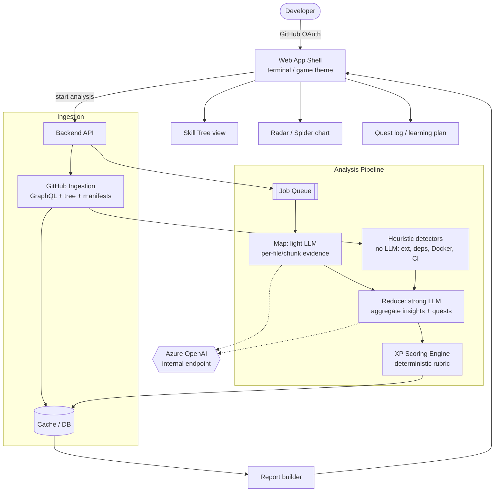
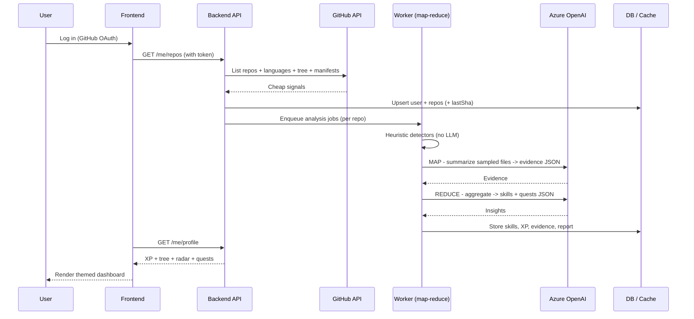
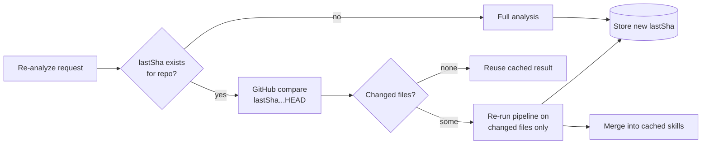
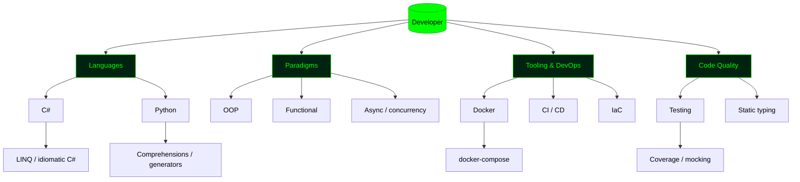
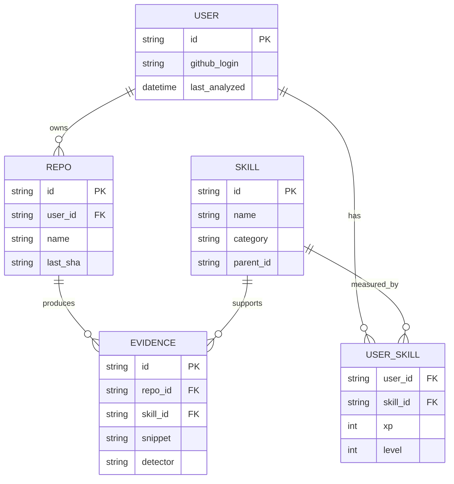
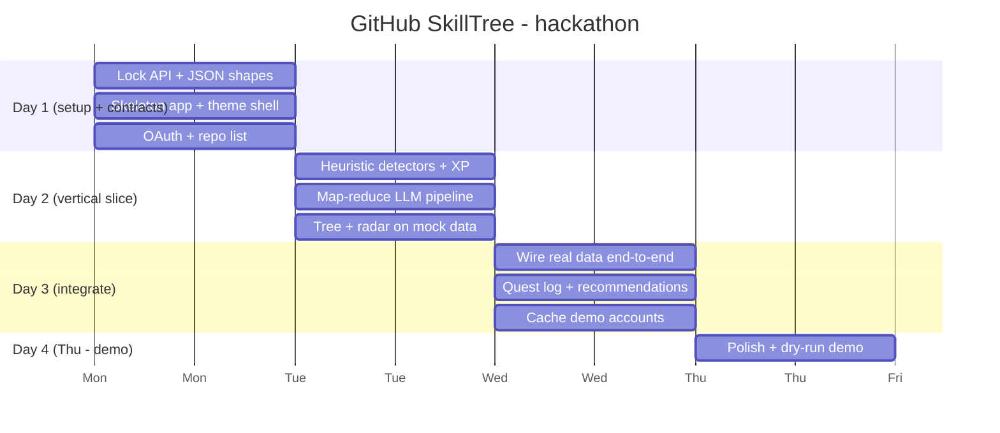

# 🌳 GitHub SkillTree

> Level up your dev skills like an RPG. Parse your GitHub, earn XP, unlock a skill tree, and get a personalized quest log to grow as a developer.

GitHub SkillTree analyzes a developer's repositories and turns the findings into a
gamified profile: **XP**, a **skill tree**, and a **radar (spider) chart**. It goes
beyond "you write Python" — it surfaces **programming paradigms** (OOP, functional,
async), **idioms & optimizations** (e.g. LINQ, list comprehensions, caching),
**tooling** (Docker, CI, tests, IaC), and then recommends whether to **deepen** an
existing skill or **expand** into an adjacent one. Wrapped in a fun
**hacker / terminal / video-game** theme.

This README is the **single source of truth** for the hackathon plan. Read it before
building anything.

---

## 🎯 Hackathon Constraints (read first)

- **Team:** 5 people. Nobody wants to own the frontend → **self-service frontend**:
  whoever builds a feature also builds the small UI slice that surfaces it, against a
  shared app shell + theme.
- **Deadline:** Thursday. That is **~3 working days**. Scope is the #1 risk — see the
  MVP cut below.
- **Judged on a demo.** Optimize for a working, good-looking demo over completeness.

> **North star for the week:** _One user logs in, sees their XP + radar chart + a small
> skill tree with one personalized "quest", themed like a terminal._ Everything else is
> a stretch goal.

---

## 🧩 What your plan was missing (gaps we filled)

Your structure (OAuth → JSON blob → light LLM → strong LLM → report → skill tree) is a
solid **map-reduce** shape. Here are the gaps we found and the decisions we made:

1. **Don't dump whole repos into a "large JSON blob."** Repos are huge → you'll blow
   past LLM context windows, burn cost/time, and hit GitHub rate limits. Instead, **gather
   cheap signals first** (file tree, extensions, language API, dependency manifests like
   `package.json` / `*.csproj` / `requirements.txt` / `go.mod`, `Dockerfile`, CI files)
   and only send **sampled / relevant file snippets** to the LLM. You can detect ~70% of
   skills with **zero LLM calls**.
2. **Use a fixed skill taxonomy, not fully LLM-generated nodes.** If every user gets a
   different tree, you can't score XP consistently, cache results, or compare users. Decision:
   **canonical skill tree is fixed**; the **LLM personalizes** evidence, levels, and the
   quest/recommendation text on top of it. (LLM-invented bonus nodes = stretch goal.)
3. **XP needs a deterministic rubric**, not LLM vibes. Define how XP is computed
   (occurrences × weight, repo spread, recency) so it's reproducible and explainable.
4. **LLM pipeline = map-reduce, say it explicitly.** "Light LLM" = per-file/per-chunk
   **map** (summarize evidence). "Strong LLM" = **reduce** (aggregate to skills + plan).
   Force **structured JSON output** (JSON schema / function calling) so it's parseable.
5. **Persistence is required.** You need a DB to cache analysis, store users, XP, and the
   **last analyzed commit SHA _per repo_** (not per account) for incremental updates.
6. **Incremental updates are a stretch goal.** Store-last-SHA + `compare` API is great but
   not needed for the demo. Build full-analysis-with-cache first.
7. **Security / Microsoft policy.** Use an **approved internal LLM endpoint (Azure OpenAI)** —
   do **not** send code to external public LLM APIs. Store OAuth tokens server-side, never in
   the repo. Decide public-only vs private repos (recommend **public-only** for the demo to
   reduce risk).
8. **GitHub rate limits:** 5,000 req/hr authenticated. Prefer the **GraphQL API** and the
   **git tree API** to minimize calls. Cache aggressively.
9. **Frontend coordination needs an API contract + shared shell.** Agree on the JSON shapes
   (below) on **day 1** so 5 people can build slices in parallel without blocking.
10. **Demo safety net.** Live LLM calls fail at the worst time. **Pre-cache 2–3 demo
    accounts** (your own repos) so the demo never depends on a live call.
11. **Learning-resource links can be hallucinated.** Keep a small **curated resource map**
    per skill; let the LLM pick/justify, not invent URLs.

---

## 🏗️ Architecture



### Analysis sequence



### Incremental update (stretch goal)



---

## 🌲 Skill model

The **canonical tree is fixed** (so XP is comparable & cacheable). Skills have categories,
prerequisites (edges), XP thresholds → levels, and "deepen vs expand" directions.



- **Deepen** = traverse *down* the same branch (C# → LINQ → expression trees).
- **Expand** = jump to a *sibling/adjacent* branch (knows OOP → try Functional).

### XP rubric (deterministic, tweak the weights)

```
skill_xp = Σ ( occurrences × pattern_weight )
         × repo_spread_bonus      # used in N repos
         × recency_bonus          # touched in last 90 days
level = floor( sqrt(skill_xp / K) )   # classic RPG curve
```

Heuristics produce the base XP; the LLM only adds **evidence + recommendations**, never
the raw score (keeps it explainable for judges).

---

## 🗃️ Data model



---

## 🔌 API contract (agree on this Day 1)

Lock these shapes early so frontend slices can be built against mock data in parallel.

| Method | Route | Purpose |
| --- | --- | --- |
| `GET` | `/auth/github` | Start OAuth |
| `GET` | `/auth/callback` | OAuth callback → session |
| `GET` | `/me/repos` | List the user's repos |
| `POST` | `/me/analyze` | Kick off analysis (returns job id) |
| `GET` | `/me/analyze/status` | Poll job progress |
| `GET` | `/me/profile` | XP + skill tree + radar + quests |

`GET /me/profile` (example shape):

```jsonc
{
  "user": "octocat",
  "totalXp": 4200,
  "radar": { "Languages": 80, "Paradigms": 55, "Tooling": 40, "Quality": 60 },
  "skills": [
    { "id": "linq", "name": "LINQ", "category": "Languages",
      "xp": 900, "level": 4, "parent": "csharp",
      "evidence": ["src/Query.cs: .Where(...).Select(...)"] }
  ],
  "quests": [
    { "skill": "functional", "type": "expand",
      "title": "Go Functional in C#",
      "steps": ["Refactor a loop to LINQ", "Read about pure functions"],
      "resources": ["https://learn.microsoft.com/dotnet/csharp/linq/"] }
  ]
}
```

---

## 👥 Team split (5 workstreams)

Each owner also builds the **small frontend slice** for their feature, on the shared shell.

| # | Workstream | Owns | Frontend slice |
| - | --- | --- | --- |
| 1 | **Auth + Ingestion** | OAuth, GitHub GraphQL/tree, manifest fetch, cache | Login + repo picker |
| 2 | **Analysis pipeline** | Queue, map-reduce LLM calls, structured output | Analysis progress view |
| 3 | **Skill taxonomy + XP engine** | Fixed tree, heuristic detectors, scoring rubric | — (data only) |
| 4 | **Visualization** | Skill tree graph + radar chart components | Tree + spider chart |
| 5 | **App shell + theme + glue** | Terminal/RPG theme, routing, integration, demo data | Dashboard + quest log |

> Person 5 also owns **integration & the demo seed accounts** — the most important
> non-feature job in a hackathon.

---

## 🛠️ Suggested stack (minimize frontend pain)

- **Backend:** one language the team knows well (Python + FastAPI **or** Node + Express).
- **Frontend:** a component-library-first approach so nobody hand-writes much CSS.
  Use **react-flow** or **Cytoscape.js** for the skill tree and **Recharts/Chart.js** for
  the radar. A terminal CSS theme (e.g. a retro/terminal CSS kit) gets the look for free.
- **DB:** SQLite or Postgres (SQLite is fine for the demo).
- **Queue:** keep it simple — async tasks / a lightweight in-process queue. Only reach for
  Redis/Celery if you have time.
- **LLM:** internal **Azure OpenAI** endpoint with **structured/JSON output**.

> Pick the stack everyone already knows. Hackathon = optimize for velocity, not novelty.

---

## 🗓️ 3-day plan (Mon → Thu)



**Milestones**
- **End of Day 1:** API contract frozen; you can log in and list repos.
- **End of Day 2:** A vertical slice works on *mock* data (tree + radar render).
- **End of Day 3:** Real data flows end-to-end; demo accounts cached.
- **Thu:** Polish + rehearse the demo. **Freeze code the night before.**

---

## ✅ MVP vs stretch

**MVP (must demo):** OAuth (or even a hard-coded token) → analyze public repos →
heuristic skills + 1 LLM-personalized quest → XP + radar + small skill tree, themed.

**Stretch:** incremental commit-diff updates · LLM-generated bonus nodes · multi-user
comparison / leaderboard · private repos · animated XP gain.

**Explicitly out of scope this week:** real auth hardening, scaling, full repo content
ingestion, per-line accuracy.

---

## ⚠️ Risks

| Risk | Mitigation |
| --- | --- |
| Scope too big for 3 days | Ruthless MVP; mock data early; stretch list is optional |
| LLM cost/latency/limits | Heuristics first; sample files; cache; map-reduce |
| Live demo flakiness | Pre-cached demo accounts; never depend on live LLM on stage |
| GitHub rate limits | GraphQL + tree API; cache; public repos only |
| Frontend bottleneck | Shared shell + frozen API contract; build on mock data |
| Sending code to external LLM | Internal Azure OpenAI only; public repos only |
