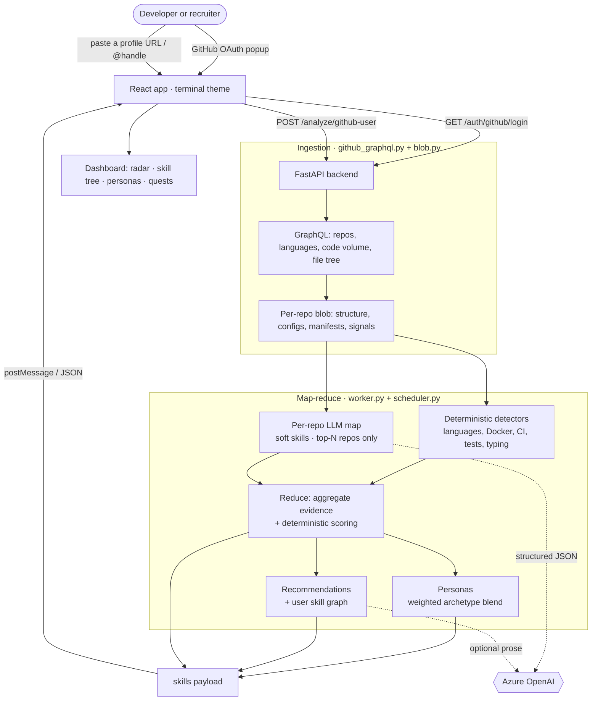
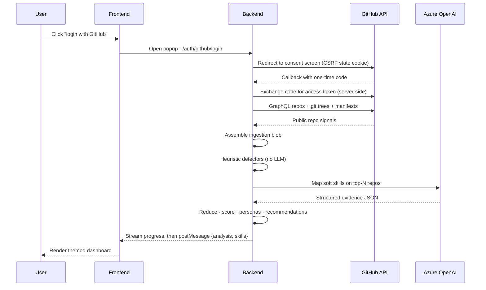
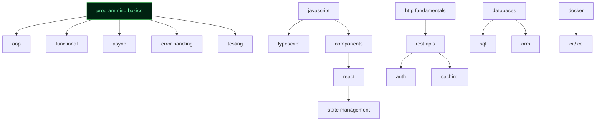
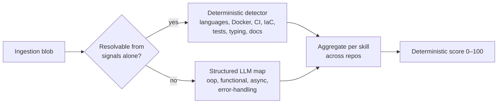

# 🌳 GitHub SkillTree

> Turn any GitHub profile into a gamified skill report: an XP-scored **skill tree**, a
> **radar chart**, a set of **coding-personality archetypes**, and a personalized
> **"learn next" quest log** — all wrapped in a hacker / terminal / RPG theme.

GitHub SkillTree reads a developer's **public** repositories and turns the findings into
a profile that goes beyond "you write Python." It surfaces **languages**, **programming
paradigms** (OOP, functional, async), **tooling & DevOps** (Docker, CI, tests, IaC),
and **code-quality** signals, scores each skill deterministically, blends them into
developer **personas**, and recommends whether to **deepen** an existing skill or
**expand** into an adjacent one.

There are two ways in:

- **Sign in with GitHub** — analyze your own repositories through a server-side OAuth flow.
- **Recruiter mode** — paste any public profile URL or `@handle` and run the same checks,
  no sign-in required.

---

## ✨ What it produces

For every analyzed profile, the dashboard renders:

| View | What it shows |
| --- | --- |
| **Profile hero** | Overall skill score (0–100) and how many canonical skills were demonstrated |
| **Skill radar** | Strength per domain (Languages, Paradigms, Tooling & DevOps, Code Quality) |
| **Skill tree** | The canonical skill DAG with demonstrated nodes lit and the rest dimmed |
| **Personas** | A "Spotify-Wrapped"-style blend of coding archetypes, strongest first |
| **Recommendations** | A ranked "grow next" list; goal-directed, with an optional written rationale |
| **Repository breakdown** | Per-repo languages, estimated code volume, detected toolchain, and structure |

---

## 🏗️ How it works

The system is a **map-reduce pipeline over cheap signals**: it gathers inexpensive
repository metadata first, resolves most skills with deterministic heuristics (no LLM),
and only spends a structured LLM call on the handful of "soft" skills that genuinely need
code reading. Scores, personas, and the default recommendations are all deterministic, so
results are reproducible and explainable.



### The sign-in path, end to end

The OAuth **client secret never reaches the browser**, and **no credentials are persisted**:
the access token is used in memory to read public data, then dropped. Nothing is written to
disk or a database.



> **Recruiter mode** runs the *same* pipeline. `POST /analyze/github-user` resolves a pasted
> username or URL, reads that user's public repositories with a backend **service token**,
> and returns the identical `{analysis, skills}` payload — so it reuses every dashboard view.

---

## 🌲 The skill model

A single **canonical skill graph** drives both detection and the visualization. It lives in
one place — `backend/app/skills/taxonomy.yaml` — and a build step exports it to
`frontend/src/data/taxonomy.json` so the two halves can never drift.

- **One DAG.** ~27 skills today, validated **acyclic** with all references resolved.
  `requires` edges encode soft ordering ("APIs before Kubernetes"); they suggest a learning
  order and power "learn next" quests, but **never lock a node**.
- **Two skill kinds.** `hard` = a concrete technology (Docker, React, webpack); `concept` =
  an idea that needs evidence (caching, REST APIs, error handling).
- **Two orthogonal overlays.** Each skill has a **domain** (~8 visual groups → colors and
  radar axes: languages, paradigms, frameworks, architecture, build-tooling, data, quality,
  infrastructure) and weighted **track** affinities (frontend, backend, fullstack,
  infrastructure, systems, mobile). A track is just a filter + topological sort over the
  same graph — *same tree, different paths*.
- **Per-skill detection config.** `evidence: deterministic | llm | hybrid`, plus the
  `signals`, file globs, content hints, and relevant languages the pipeline uses. Anything
  resolvable from cheap signals is free; only a bounded subset of concepts is sent to the LLM.



### How skills are detected



- **Layer 1 — deterministic heuristics** (`detectors.py`). Languages come from GitHub's byte
  breakdown; hard skills come from detected config/manifest files and structural signals
  (`hasDocker`, `hasCi`, `hasTests`, …). Zero LLM calls, zero hallucination.
- **Layer 2 — bounded LLM map** (`worker.py`). Only the "soft" skills that need code reading
  get a single **structured-JSON** call, and only the **top-N repositories by estimated code
  volume** are sent. Any failure degrades gracefully to heuristics-only.

### Scoring

Raw evidence accumulates into an unbounded `strength` per skill, mapped onto a 0–100 score
with a saturating curve so early signal counts for a lot and skills hit diminishing returns
as they approach mastery:

$$\text{score} = 100 \times \left(1 - e^{-\,\text{strength} / \text{scale}}\right)$$

The `scale` constant (default **90**) tunes how quickly skills peg toward 100. Heuristics and
the LLM only *produce evidence* — the score itself is always computed deterministically, which
keeps it reproducible and explainable.

---

## 🎭 Personas

After scoring, `personas.py` blends the skill profile into **coding-personality archetypes** —
no LLM, just a deterministic weighted blend over skill scores and repo-shape features
(language diversity, repo volume, average repo size, recency, breadth, informality, …). Each
persona gets a 0–100 score and a share of the mix; the dashboard headlines the primary one and
lists the rest.

The ten archetypes: **The Architect**, **The Problem-Solver**, **The Vibe-Coder**,
**The UI Artisan**, **The DevOps Whisperer**, **The Test Guardian**, **The Polyglot
Explorer**, **The Open-Source Citizen**, **The Refactoring Monk**, and **The Library Builder**.

---

## 🧭 Recommendations

The recommendation engine ranks the canonical taxonomy against the user's demonstrated
strengths to answer "what should I learn next?":

- A **deterministic ranking** combines target relevance, unmet prerequisites, and current
  weakness into reason-coded suggestions (`target`, `prerequisite`, `weak`).
- When a **goal** is supplied and the recommendation LLM is configured, a short written
  rationale is generated on top of the ranking. Without it, the ranking stands on its own.

The default "grow next" list rides along with the analysis payload; goal-directed requests go
through `POST /recommend`. The engine and the user-skill builder derive their skill list from
the *same* `taxonomy.yaml`, so there is no second source of truth to drift.

---

## 📁 Project structure

```
github-skilltree/
├── backend/                     FastAPI server (Python 3.12)
│   └── app/
│       ├── main.py              routes, OAuth, streamed progress popup, recruiter endpoint
│       ├── config.py            typed settings loaded from .env
│       ├── github_oauth.py      authorize-URL builder + server-side token exchange
│       ├── github_graphql.py    Stage 1 — repo listing, languages, code volume, file tree
│       ├── blob.py              ingestion blob — per-repo structure, configs, manifests, signals
│       ├── detectors.py         Layer 1 deterministic skill heuristics (no LLM)
│       ├── file_context.py      SSRF-safe reader for public raw file bytes
│       ├── worker.py            per-repo map — heuristics + one structured LLM call
│       ├── scheduler.py         fan-out, reduce, scoring, persona attachment
│       ├── llm_client.py        Azure OpenAI structured-JSON client
│       ├── personas.py          deterministic coding-personality archetypes
│       ├── recommend.py         bridge to the recommendation engine + user-skill builder
│       └── skills/
│           ├── taxonomy.yaml    the single canonical skill graph (source of truth)
│           ├── models.py        pydantic loader + acyclic/reference validator
│           ├── export.py        emits frontend/src/data/taxonomy.json
│           └── canonical.py     taxonomy → canonical-skill projection
├── frontend/                    Vite + React 19 + TypeScript + Tailwind v4
│   └── src/
│       ├── pages/               Landing, Dashboard, Recruiter, skill-tree & radar demos
│       ├── components/          game/ · terminal/ · landing/ · effects/ · ui/
│       ├── lib/                 auth client, taxonomy projection, radar math
│       ├── hooks/               useGitHubAuth, boot sequence, scroll/reveal, …
│       └── data/                taxonomy.json (generated) + mock/demo data
├── recommendation_engine/       deterministic ranking + optional LLM explanation
├── user_skill_builder/          analysis → user skill graph ([{name, strength, prerequisites}])
└── sample_outputs/              cached example analyses for offline preview
```

---

## 🔌 API

| Method | Route | Purpose |
| --- | --- | --- |
| `GET` | `/health` | Liveness + whether OAuth and recruiter mode are configured |
| `GET` | `/auth/github/login` | Start the OAuth flow (redirect to GitHub) |
| `GET` | `/auth/github/callback` | OAuth return — streams a progress popup, then `postMessage`s the result |
| `POST` | `/analyze` | Run the pipeline on a posted ingestion blob (`?dryRun=true`, `?maxRepos=N`) |
| `POST` | `/analyze/github-user` | Recruiter mode — analyze any public profile by username / URL |
| `POST` | `/recommend` | Goal-directed recommendations (deterministic ranking + optional written rationale) |

The analysis payload (`skills`) carries `skillset`, `overallScore`, `topSkills`, `personas`,
`recommendations`, and `userSkillTree`; the repository payload (`analysis`) carries per-repo
languages, code volume, structure, detected configs, and signals (the heavy recursive file
tree is stripped before it reaches the browser).

---

## 🧰 Tech stack

- **Backend:** Python 3.12 · FastAPI · httpx · pydantic-settings · PyYAML · OpenAI SDK (Azure)
- **Frontend:** Vite 8 · React 19 · TypeScript 6 · Tailwind CSS v4 · react-router-dom 7 ·
  Recharts 3 · Framer Motion 12
- **LLM:** Azure OpenAI — `gpt-4.1-mini` for the analysis map stage; a separate deployment for
  the optional recommendation rationale. The map stage forces **structured JSON output**.
- **Data sources:** GitHub GraphQL API (repos, languages, code volume, file trees) and the REST
  git-tree API (recursive structure). Public repositories only.

---

## 🚀 Running locally

### Backend

```powershell
cd backend
python -m venv .venv
.\.venv\Scripts\Activate.ps1
pip install -r requirements.txt

# Configure credentials
Copy-Item .env.example .env      # then fill in the values below

uvicorn app.main:app --reload --port 8000
```

### Frontend

```powershell
cd frontend
npm install
npm run dev                      # http://localhost:5173
```

### Regenerating the taxonomy

After editing `taxonomy.yaml`, re-export the JSON the frontend reads:

```powershell
cd backend
python -m app.skills.export
```

### Environment variables (`backend/.env`)

| Variable | Required for | Notes |
| --- | --- | --- |
| `GITHUB_CLIENT_ID` / `GITHUB_CLIENT_SECRET` | OAuth sign-in | From a GitHub OAuth app; secret stays server-side |
| `GITHUB_SERVICE_TOKEN` | Recruiter mode | A PAT that reads **public** data only; enables `/analyze/github-user` |
| `AZURE_OPENAI_ENDPOINT` / `AZURE_OPENAI_API_KEY` / `AZURE_OPENAI_DEPLOYMENT` | LLM skill mapping | Without these, run analysis with `?dryRun=true` for heuristics only |
| `AZURE_OPENAI_RECOMMENDATION_*` | Written recommendation rationale | Optional; ranking works without it |

> The frontend reads `VITE_API_BASE_URL` (default `http://localhost:8000`). Only `VITE_*`
> variables are bundled to the browser — never put a secret in one.

---

## 🔒 Security notes

- **Secrets stay server-side.** The OAuth client secret and all tokens live in
  `backend/.env` (git-ignored). Tokens are used in memory and dropped — never persisted.
- **Public repositories only.** The OAuth scopes and the recruiter service token are limited to
  public read.
- **SSRF-safe file reads.** `file_context.py` is host-locked to `raw.githubusercontent.com`,
  refuses redirects, caps bytes, and skips binaries.
- **Code never leaves an approved endpoint.** Sampled snippets go only to the configured Azure
  OpenAI endpoint, never to a public LLM API.
